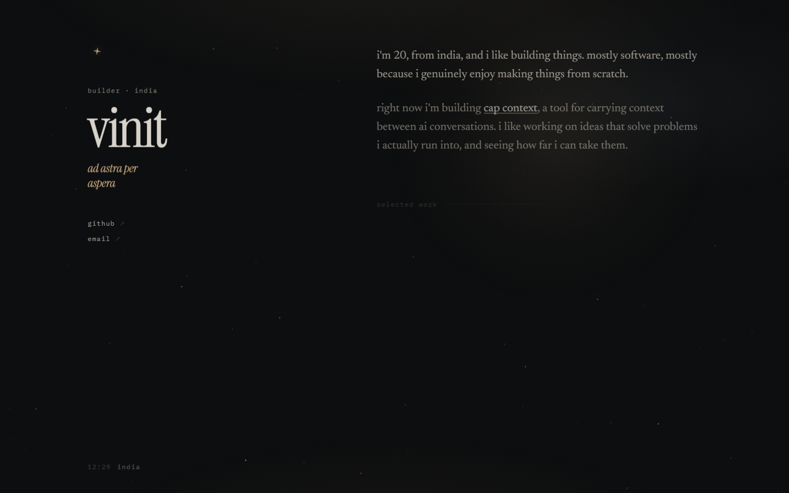

# Vinit’s Personal Site

> A focused, single-page portfolio for **Vinit Rajpurohit** — a builder from India creating practical software from scratch.



This repository contains the source for a dark, editorial-style personal portfolio. The site presents Vinit’s work, current focus, and ways to connect through a deliberately minimal experience shaped around the motto *ad astra per aspera* — “to the stars through difficulties.”

## Highlights

| Area | Included experience |
| --- | --- |
| **Personal introduction** | A full-screen hero, concise bio, and a clear statement of what Vinit is currently building. |
| **Selected work** | Dedicated cards for **CapContext** and **Spreadz**, with short descriptions and status information. |
| **Atmosphere** | A responsive star-field canvas, gentle lighting, grain texture, and subtle pointer-following glow. |
| **Motion** | Scroll-triggered reveals and restrained animations, with a reduced-motion fallback. |
| **Responsive design** | Layout and typography adapt for mobile, tablet, and desktop viewports. |
| **Accessibility basics** | A skip link, semantic sections, visible focus states, polite live clock updates, and `prefers-reduced-motion` support. |

## Built With

The portfolio intentionally has **no build step or framework dependency**. It runs as a static website and is composed of the following files.

| Technology | Purpose |
| --- | --- |
| **HTML** | Provides the document structure and accessible, semantic content. |
| **CSS** | Defines the visual system, responsive layout, animation, and atmospheric effects. |
| **Vanilla JavaScript** | Powers the local clock, reveal-on-scroll effects, pointer glow, and animated star field. |
| **Google Fonts** | Supplies the Space Grotesk, Newsreader, and IBM Plex Mono typefaces. |

## Run Locally

Clone the repository and open `index.html` in a modern browser. For a more reliable local development experience, serve the directory with a small static server.

```bash
git clone https://github.com/spidey889/personal-site.git
cd personal-site
python3 -m http.server 8000
```

Then visit [http://localhost:8000](http://localhost:8000).

## Project Structure

```text
.
├── index.html          # Page content, structure, metadata, and external links
├── styles.css          # Visual language, responsive rules, and animations
├── script.js           # Interactive effects and live local-time clock
├── favicon.svg         # Site favicon
└── preview/
    └── desktop.png     # Desktop preview used in this README
```

## Personalizing the Site

The site is designed to be easy to update without tooling. Edit `index.html` to change the name, bio, project descriptions, contact links, and page metadata. Update the CSS custom properties near the top of `styles.css` to adjust the palette, type scale, spacing, or motion timing. Interactive behavior is isolated in `script.js`.

| What to update | Where to update it |
| --- | --- |
| Name, tagline, bio, projects, and contact links | `index.html` |
| Colour palette, typography, layout, and breakpoints | `styles.css` |
| Time zone, canvas stars, scroll reveals, and pointer effects | `script.js` |
| Browser-tab icon | `favicon.svg` |

## Current Work

The portfolio currently features the following projects.

| Project | Description |
| --- | --- |
| **CapContext** | A Chrome extension for carrying context between AI conversations across Claude, ChatGPT, Gemini, Grok, and DeepSeek. |
| **Spreadz** | A real-time chat platform built solo for college students. |

## Deployment

Because this is a static site, it can be deployed on any static hosting platform. GitHub Pages is a simple option: publish the repository’s root directory from the `main` branch in the repository’s Pages settings.

## License

No license has been added yet. If you intend others to reuse this code, add a license file that reflects the permissions you want to grant.

---

Built by [Vinit Rajpurohit](https://github.com/spidey889).
